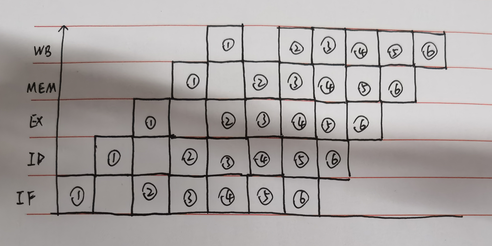
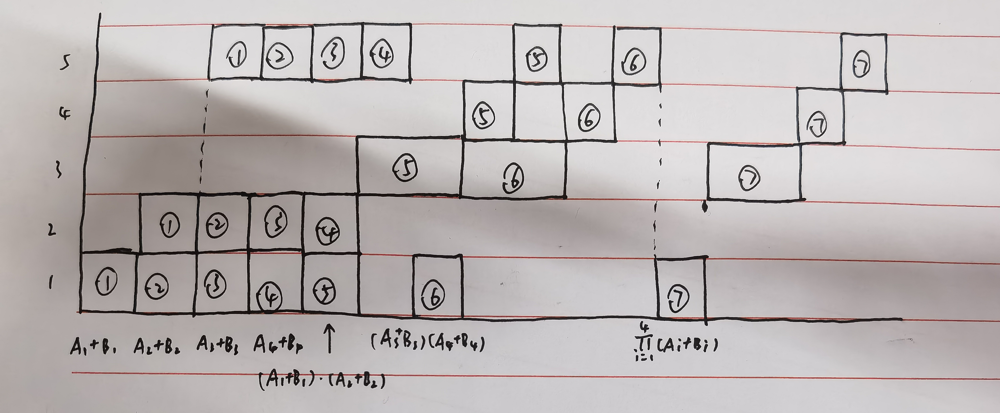

## 一、
### 1.
从指令1到指令2存在对于寄存器R1的RAW相关
从指令2到指令3存在对于寄存器R1的RAW相关
从指令4到指令5存在对于寄存器R2的RAW相关
从指令5到指令6存在对于寄存器R4的RAW相关

### 2.
画出时序图如下：

可以看到，由于没有bypass，所有存在RAW的指令之间都需要等待两个周期（后一条指令的ID阶段和前一条指令的WB阶段在同一个周期）；同时，分支预测需要冲刷流水线，而分支结果在EX阶段得到，因此下一条指令的IF阶段与分支指令的MEM阶段在同一个周期，也需要等待两个周期。这一循环一次迭代需要16个周期，一共执行99次，因此总共需要99*16=1584个周期。

### 3.
画出时序图如下：

由于有完整的旁路路径，因此只有Load-Use相关（即第1和第2条指令之间）需要等待一个周期；同时由于采用预测转移失败的策略，因此只有循环结束时分支预测正确，前面的分支预测都错误，需要冲刷流水线，后一条指令延迟2个周期。
这种情况下除最后一次迭代外，前面每次迭代都需要9个周期；最后一次迭代由于分支预测正确，下一条指令和循环中第6条指令间没有延迟，这里取第五条指令写回完成作为循环结束的时间点，因此最后一次迭代需要10个周期，总共需要10+9*98=892个周期。如果取循环跳出后下一条指令开始执行作为循环结束的时间点，则最后一次迭代需要7个周期，一共需要889个周期。

### 4.
这里与3中基本相同（时序图也基本相同），但由于分支预测策略改变，只有最后一次迭代分支预测失败。前面每次迭代只需要7个周期，最后一次迭代如果取第五条指令写回完成作为循环结束的时间点，需要10个周期，总共需要10+7\*98=696个周期。如果取循环跳出后下一条指令开始执行作为循环结束的时间点，则最后一次迭代需要9个周期，一共需要695个周期。

## 二、
先计算4次加法，再计算3次乘法，时空图如下：

如图，总共用了16个$\Delta t$。
- 吞吐率：由于总共执行了7次运算，因此吞吐率为$\frac{7}{16}$。
- 加速比：如果不使用流水线，总共进行4次加法和3次乘法，每次加法需要$3\Delta t$，乘法需要$5\Delta t$，总共需要$4*3+3*5=27\Delta t$。因此加速比为$\frac{27}{16}$。
- 效率：5个流水段总的工作时间为$4*3+3*5=27\Delta t$，效率为$\frac{27\Delta t}{5\times 16\Delta t} = \frac{27}{80} = 33.75\%$。

## 三、
如果时钟周期由最长延迟流水级确定，则解答如下：
### 1.
由于sw和lw在MEM阶段都需要访问存储器，因此add指令的取指需要延迟2个周期，总共需要11个周期，执行时间为$11 \times 200 = 2200ps$。
对于题中描述的这种数据相关，插入nop不能解决。因为nop也需要取指，仍然会与数据访存发生冲突。

### 2.
这里不考虑第1题中访存的结构相关。
如果在EXE段确定分支，则下一条指令需要延迟2个周期，总共需要11个周期；如果在ID段确认，则只需要延迟1个周期，总共需要10个周期。加速比为$\frac{11}{10}=110\%$。

### 3.
分支判断从EXE移到ID时，EXE的延迟变为140ps，ID段延迟变为180ps，最长的流水级仍为IF段，因此答案不变，和第2题一样。

### 4.
分支判断从EXE移到MEM时，EXE级延迟变为130ps，MEM级延迟变为210ps，时钟周期变为210ps，beq的下一条指令需要延迟3个周期，因此总执行时间为$12\times 210 = 2520ps$，加速比为$\frac{2200}{2520}\simeq 87.3\%$，速度反而变慢了。

如果考虑各段时间不等的流水线，则解答如下：
### 1.
由于sw和lw在MEM阶段都需要访问存储器，因此add指令的取指需要延迟260ps（从beq取指结束到lw访存结束的时间）。总时间为$200+120+150+190+100+200\times 4+260 = 1820ps$。
对于题中描述的这种数据相关，插入nop不能解决。因为nop也需要取指，仍然会与数据访存发生冲突。

### 2.
这里不考虑第1题中访存的结构相关。
如果在EXE阶段确定分支，则下一条指令需要延迟270ps（ID段+EXE段），总共需要1830ps；如果在ID段确认，则只需要延迟120ps，总共需要1680ps。加速比为$\frac{1830}{1680}\simeq 109\%$。

### 3.
这里同样不考虑第1题提到的结构相关。当分支判断在EXE阶段时，根据第2题计算的结果，需要1830ps；当分支判断在ID段时，ID段的延迟变为180ps，EXE段延迟变为140ps，而beq的下一条指令需要延迟180ps，因此总时间为$200+180+140+190+100+200*4+180=1790ps$，加速比为$\frac{1830}{1790}\simeq 102.23\%$。

### 4.
分支判断从EXE移到MEM时，EXE级延迟变为130ps，MEM级延迟变为210ps。在这种情况下，时钟周期难以定义（各段时间不等的流水线如何定义时钟周期？）。beq指令的下一条指令需要延迟460ps（ID段+EXE段+MEM段），总时间为$200+120+130+210+100+210*4+460=2060ps$。加速比为$\frac{1830}{2060}\simeq 88.8\%$。速度也变慢了。