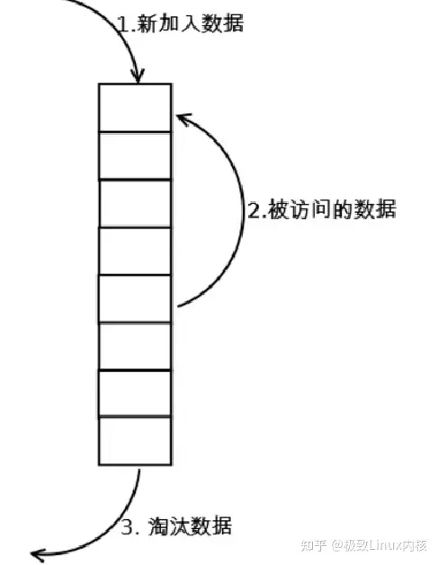
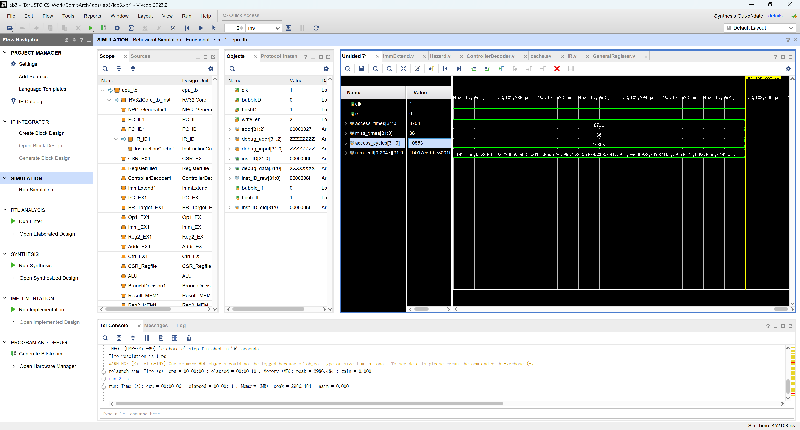
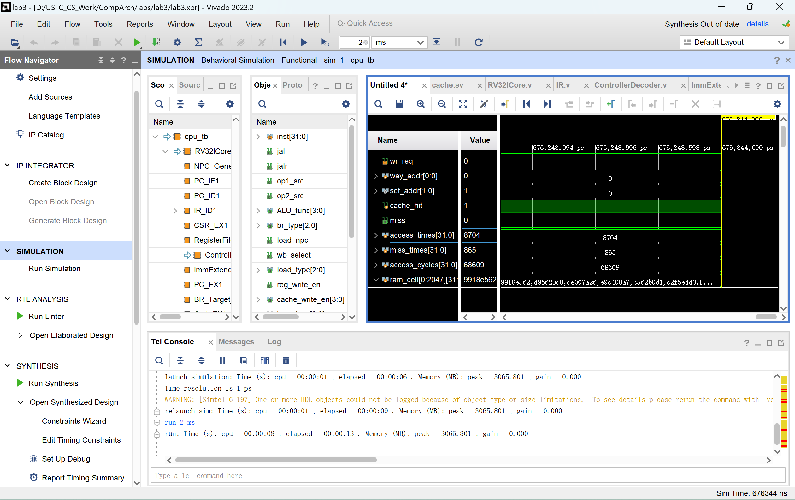
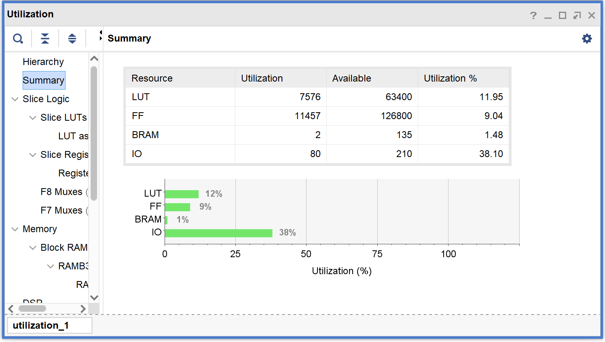
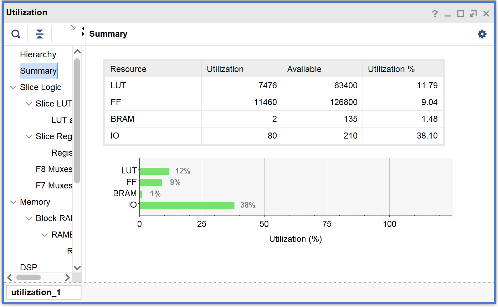
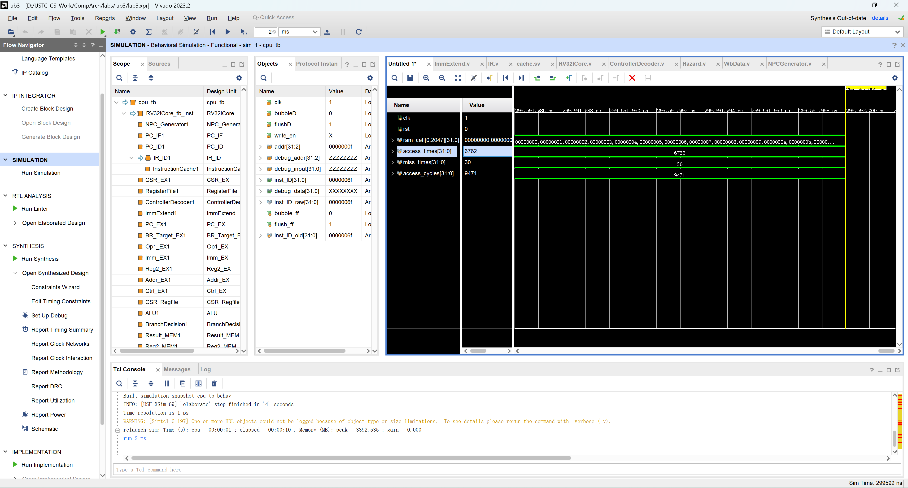
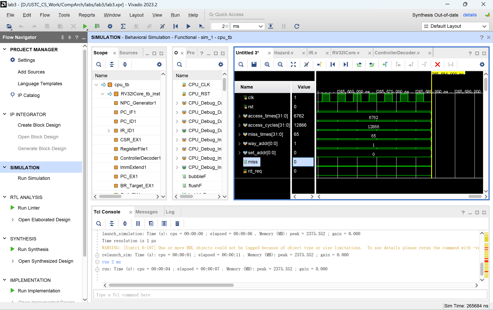
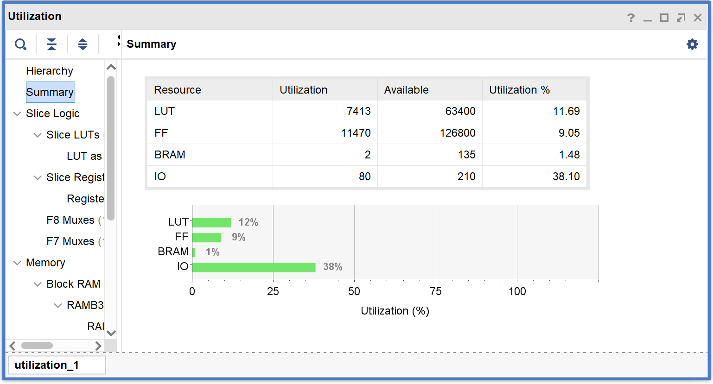
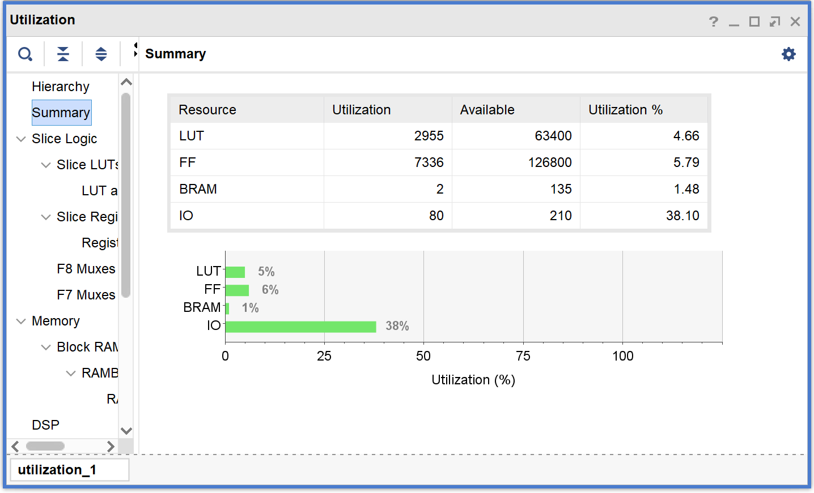

# Lab 3 Report

## 代码实现
### 修改为组相联
大体上在`cache_mem`、`cache_tags`等寄存器数组的定义中加入大小为`WAY_CNT`的一维即可。

出于方便起见，增加了参数`WAY_ADDR_LEN`，代表路地址的长度。由于我们需要将选中的路地址定义为`reg [WAY_ADDR_LEN-1:0] way_addr`，因此为了防止路数为1时编译出错，将`WAY_ADDR_LEN`定义为`WAY_CNT > 1 ? $clog2(WAY_CNT) : 1`。并在选择路数时做一个特别判定，当`WAY_CNT`为1时，固定选中第0路。

判断命中的逻辑也需要做一些修改，改为用for语句并行比较每一路的Tag。
```verilog
always @(*) begin
    for(integer i = 0; i < WAY_CNT; i++) begin
        if(valid[i][set_addr] && cache_tags[i][set_addr] == tag_addr) begin
            hit_way[i] = 1'b1;
        end 
        else begin
            hit_way[i] = 1'b0;
        end
    end
end
```
这里的`hit_way`是一个`WAY_CNT`位的向量，表示每一路是否命中。
为了将`hit_way`翻译为命中的路号，使用了一个独热码译码器：
```verilog
reg [WAY_ADDR_LEN-1:0] onehot2bin [1 << WAY_CNT];  // 独热码转二进制码
initial begin
    if(WAY_CNT > 1) begin
        for(integer i = 1, j = 0; i < (1 << WAY_CNT); i = i << 1, j++) begin
            onehot2bin[i] = j[WAY_ADDR_LEN-1:0];
        end
    end 
end
```
这里的`onehot2bin`是一个`2^WAY_CNT`位的数组，表示独热码到二进制码的映射。在命中判断后，使用`hit_way`作为索引，得到命中的路号。这一译码器在后面还会复用。

### 替换策略
#### LRU
LRU用类似这样的思路实现：

即为每一组中每一路都维护一个序号，范围为0到`WAY_CNT-1`，表示最后使用的“时间”。每次**命中**时将对应组中命中的那一路的序号置为`WAY_CNT-1`，大于这一路的序号减1，其他路不变。当发生缺失时，选择序号为0的路替换:
```verilog
always @(posedge clk or posedge rst) begin
    if(rst) begin
        for(integer i = 0; i < SET_SIZE; i++) begin
            for(integer j = 0; j < WAY_CNT; j++) begin
                lru[j][i] <= j[WAY_ADDR_LEN-1:0];
            end
            
            lru_way[i] <= 0;
        end
    end
    else if(cache_stat == IDLE && cache_hit && (wr_req | rd_req)) begin
        for(integer i = 0; i < WAY_CNT; i++) begin
            if(lru[i][set_addr] > lru[way_addr][set_addr]) begin    // 如果有路的LRU计数器比命中的路的大，则减1，相当于整体往前移动
                lru[i][set_addr] <= lru[i][set_addr] - 1;
            end
        end
        lru[way_addr][set_addr] <= WAY_CNT-1;   // 命中的路号置为最大值
        lru_way[set_addr] <= onehot2bin[lru_onehot];
    end
end
```
这里的`lru_way`存储的是**下一次**发生缺失时应该替换的路号。`lru_onehot`是一个`WAY_CNT`位的向量，表示本次更新完LRU计数器后序号为0的路号，通过for语句并行比较得到。`onehot2bin`是上面提到的独热码译码器。

#### FIFO
FIFO的实现和LRU基本一致，区别在于LRU在每次**命中时**更新LRU计数器，而FIFO在每次**缺失后换入新的数据时**更新。

### 流水线适配
适配流水线主要是将重新编写的cache替换`WB_Data`中的cache，并将miss信号传递给hazard单元，hazard单元在每次缺失时冻结整个流水线。

## 矩阵乘法测试
使用16*16大小的矩阵进行测试。由于对于不同的缓存，运行的指令是固定的，只有访存时间不同，因此下面用**命中率**和**访存周期数**来评估性能。

为减少报告篇幅，下面仅给出两种最优配置下的仿真和综合截图。

### Cache容量对性能的影响
这里我们固定路数为4路，通过改变Line和Set大小来控制Cache容量。
对于使用FIFO替换策略的情况：
| LINE_ADDR_LEN | SET_ADDR_LEN | TAG_ADDR_LEN | 缓存大小（字数） | 命中率 | 访存周期数 |
| ------------- | ------------ | ------------ | ------ | ------ | ------ |
|1|2|8|32|39.15%|307995|
|1|3|7|64|43.20%|288987|
|1|4|6|128|43.66%|286827|
|2|2|7|64|45.22%|279479|
|2|3|6|128|45.31%|279047|
|2|4|5|256|77.83%|126123|
|3|2|6|128|44.85%|281199|
|3|3|5|256|80.02%|115853|
|3|4|4|512|98.35%|17309|
|4|2|5|256|80.80%|112165|
|4|3|4|512|99.17%|13005|
|4|4|3|1024|99.45%|11295|
|5|2|4|512|99.59%|10853|
|5|3|3|1024|99.72%|9999|
|5|4|2|2048|99.72%|9999|

观察数据可看出，当缓存容量达到256个字时，缺失率会显著下降，达到512个字时，缺失率低于2%，继续提升缓存容量带来的提升命中率提升已不明显。另外，提升Line大小带来的提升会略微好于提升Set大小。

对于LRU替换策略的情况，变化趋势是类似的。在这里给出仅改变Line大小的数据（同样是4路Cache）：

| LINE_ADDR_LEN | SET_ADDR_LEN | TAG_ADDR_LEN | 缓存大小（字数） | 命中率 | 访存周期数 |
| ------------- | ------------ | ------------ | ------ | ------ | ------ |
|1|2|8|32|39.71%|305403|
|2|2|7|64|45.22%|279479|
|3|2|6|128|46.32%|274287|
|4|2|5|256|84.11%|96613|
|5|2|4|512|99.68%|10421|

### 替换策略对性能的影响

从上面的测试数据可以看出，LRU始终优于FIFO。

### 相联度对性能的影响

考虑到LRU始终优于FIFO，且矩阵乘法的访存空间一共才768个字，不宜用太大（512字）的缓存，这里我针对采用LRU替换策略，缓存大小为256个字的情况进行测试。

<!-- #### FIFO替换策略
| WAY_CNT | LINE_ADDR_LEN | SET_ADDR_LEN | TAG_ADDR_LEN | 命中率 | 访存周期数 |
| ------- | ------------- | ------------ | ------------ | ------ | ------ |
|1|5|4|2|93.86%|50735|
|1|4|5|2|93.59%|52063|
|1|3|6|2|93.06%|54511|
|2|5|3|3|91.11%|63333|
|2|4|4|3|91.28%|61723|
|2|3|5|3|92.07%|55879|
|4|5|2|4|99.59%|10853|
|4|4|3|4|99.17%|13005|
|4|3|4|4|98.35%|17309|
|8|5|1|5|99.57%|10959|
|8|4|2|5|99.16%|13111|
|8|3|3|5|98.32%|17521|

分析上述结果得知，相联度为4，Line地址5位，Set地址2位时命中率和访存周期数均为最优。

最优情况下的仿真结果：
 -->

<!-- #### LRU替换策略 -->
| WAY_CNT | LINE_ADDR_LEN | SET_ADDR_LEN | TAG_ADDR_LEN | 命中率 | 访存周期数 |
| ------- | ------------- | ------------ | ------------ | ------ | ------ |
|1|5|3|3|82.47%|104249|
|1|4|4|3|87.90%|78793|
|1|3|5|3|88.57%|75677|
|1|2|6|3|87.70%|79789|
|2|5|2|4|90.06%|68609|
|2|4|3|4|89.97%|69073|
|2|3|4|4|86.68%|84533|
|4|5|1|5|84.75%|93557|
|4|4|2|5|84.11%|96613|
|4|3|3|5|82.23%|105485|

分析上述结果得知，相联度为2，Line地址5位，Set地址2位时命中率和访存周期数均最优。

最优情况下的仿真结果：


### 电路资源变化
这里给出上面最佳配置下，FIFO和LRU替换策略的电路资源使用量，综合时使用的设备类型为xc7a100tcsg324-1（模数电路实验和组成原理实验中使用的开发板类型）。

**FIFO替换，2路组相联，Line地址5位，Set地址2位：**


**LRU替换，2路组相联，Line地址5位，Set地址2位**


可以看到，采用LRU策略的Cache使用的FF数量略多于FIFO，但使用的查找表数量反而少于FIFO，显然LRU替换、2路组相联、Line地址5位、Set地址2位是最优配置。

## 快速排序测试
使用256个字的数组进行快速排序测试。由于对于不同的缓存，运行的指令是固定的，只有访存时间不同，因此下面用**命中率**和**访存周期数**来评估性能。

### Cache容量对性能的影响

考虑到快速排序的数据量比矩阵乘法小，这里我们固定路数为2路，通过改变Line和Set大小来控制Cache容量。
对于使用FIFO替换策略的情况：
| LINE_ADDR_LEN | SET_ADDR_LEN | TAG_ADDR_LEN | 缓存大小（字数） | 命中率 | 访存周期数 |
| ------------- | ------------ | ------------ | ------ | ------ | ------ |
|1|2|8|16|73.82%|152562|
|1|3|7|32|79.78%|119209|
|1|4|6|64|84.92%|90384|
|2|2|7|32|89.28%|70138|
|2|3|6|64|92.22%|52088|
|2|4|5|128|94.45%|38134|
|3|2|6|64|95.52%|34454|
|3|3|5|128|97.10%|24048|
|3|4|4|256|98.48%|15859|
|4|2|5|128|98.42%|16590|
|4|3|4|256|99.19%|11655|
|4|4|3|512|99.69%|7895|
|5|1|5|128|98.96%|13395|
|5|2|4|256|99.53%|9685|
|5|3|3|512|99.84%|7355|

考虑到用于排序的数组一共才256个字，这里并没有测试比512字更大的缓存。

可以看到，随着缓存容量增加，命中率逐渐上升。在同等容量的情况下，Line大小较大的缓存无论是命中率了还是访存周期数都更优。

LRU替换策略的情况类似，下面给出仅改变Line大小的数据：
| LINE_ADDR_LEN | SET_ADDR_LEN | TAG_ADDR_LEN | 缓存大小（字数） | 命中率 | 访存周期数 |
| ------------- | ------------ | ------------ | ------ | ------ | ------ |
|1|2|8|16|74.45%|147591|
|2|2|7|32|89.78%|66690|
|3|2|6|64|96.02%|30954|
|4|2|5|128|98.48%|16167|
|5|2|4|256|99.53%|9685|

可以看到，采用LRU替换策略的缓存性能始终优于或持平于FIFO

### 相联度对性能的影响

这里比较两种情况：FIFO替换策略的256字缓存和LRU替换策略的128字缓存。

#### FIFO替换策略
| WAY_CNT | LINE_ADDR_LEN | SET_ADDR_LEN | TAG_ADDR_LEN | 命中率 | 访存周期数 |
| ------- | ------------- | ------------ | ------------ | ------ | ------ |
|1|5|3|3|98.70%|15673|
|1|4|4|3|98.58%|15949|
|1|3|5|3|98.02%|18989|
|2|5|2|4|99.53%|9685|
|2|4|3|4|99.19%|11655|
|2|3|4|4|98.48%|15859|
|4|5|1|5|99.56%|9471|
|4|4|2|5|99.22%|11494|
|4|3|3|5|98.52%|15540|
|8|4|1|6|99.17%|11759|
|8|3|2|6|98.37%|16442|

当相联度为4，Line地址5位，Set地址1位时命中率和访存周期均最优。

最优策略下的仿真截图：


#### LRU替换策略
| WAY_CNT | LINE_ADDR_LEN | SET_ADDR_LEN | TAG_ADDR_LEN | 命中率 | 访存周期数 |
| ------- | ------------- | ------------ | ------------ | ------ | ------ |
|1|5|2|4|97.12%|26541|
|1|4|3|4|97.26%|24598|
|1|3|4|4|96.26%|29934|
|2|5|1|5|99.04%|12866|
|2|4|2|5|98.48%|16167|
|2|3|3|5|97.16%|23624|
|4|4|1|6|98.49%|16062|
|4|3|2|6|97.20%|23306|
|4|2|3|6|94.62%|36916|
|8|3|1|7|97.20%|23306|
|8|2|2|7|94.63%|36758|
|8|1|3|7|89.37%|63522|

当相联度为2，Line地址5位，Set地址1位时命中率与访存周期均最优。

最优策略下的仿真截图：


### 电路资源变化
这里给出上面两种最佳配置下的电路资源使用量，综合时使用的设备类型同样为xc7a100tcsg324-1（模数电路实验和组成原理实验中使用的开发板类型）。

**FIFO替换，4路组相联，Line地址5位，Set地址1位：**


**LRU替换，2路组相联，Line地址5位，Set地址1位：**


可以看到，128字的LRU缓存使用的查找表数量是256字FIFO缓存的39.86%，FF数量为63.96%。综合考虑电路规模和两者的性能，前者（LRU替换，2路组相联，Line地址5位，Set地址1位）为最优配置。