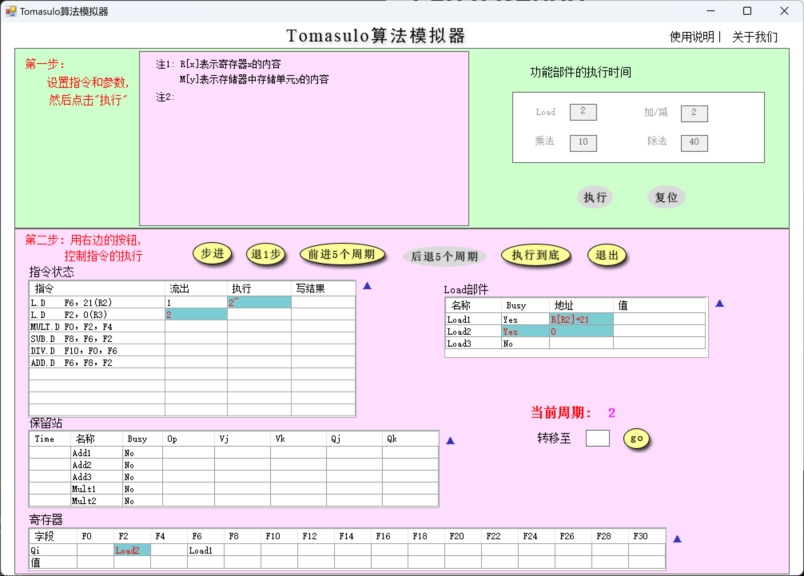
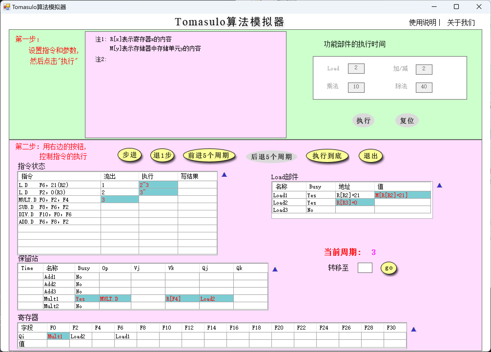
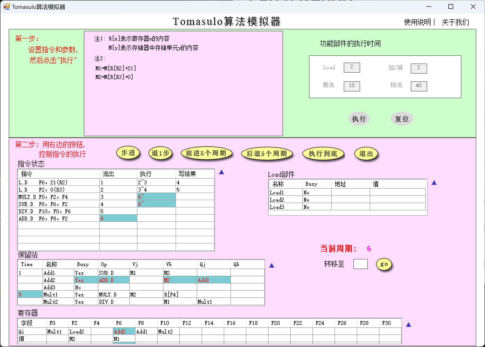
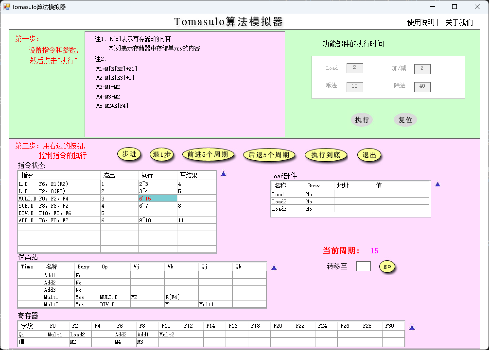
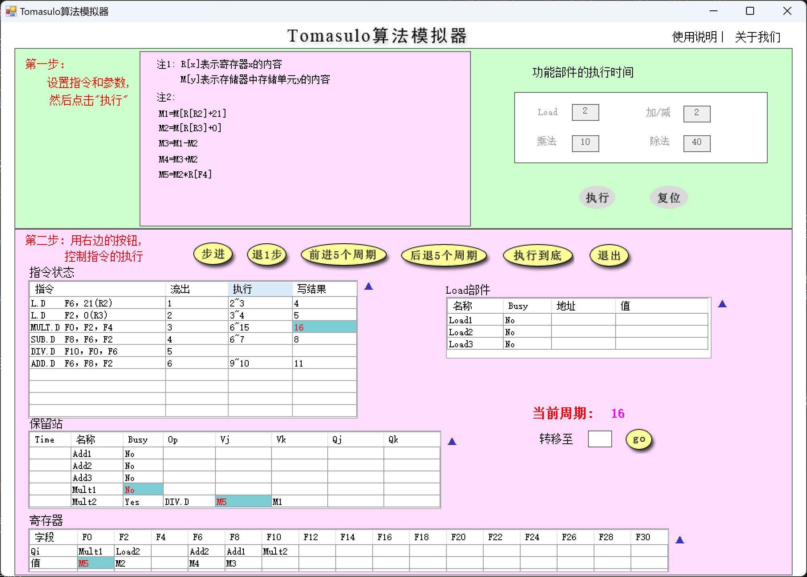
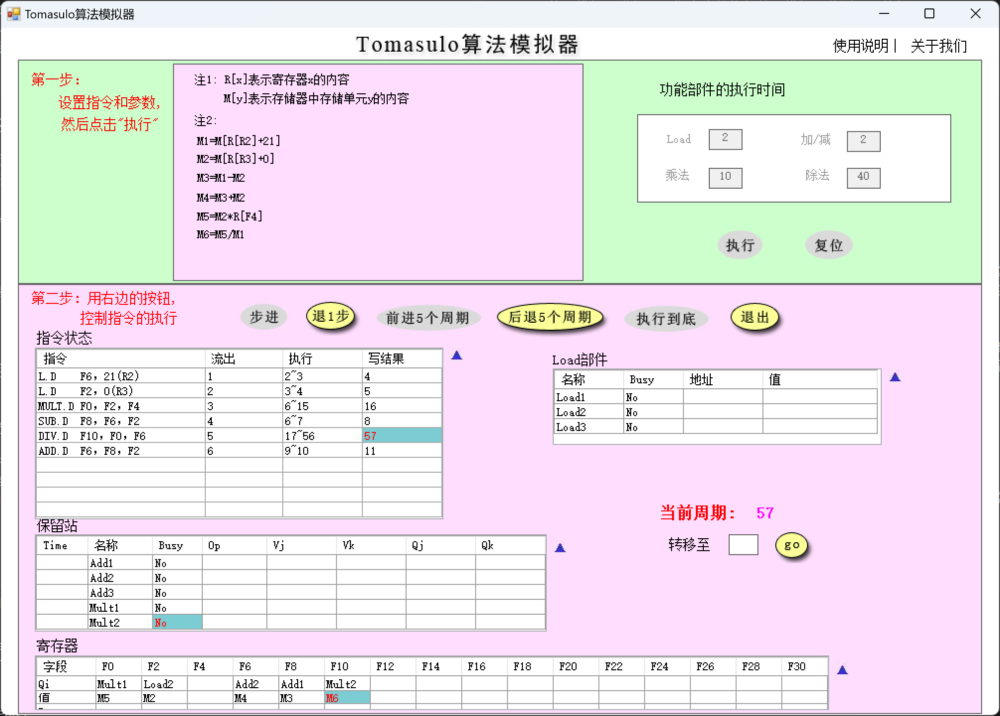
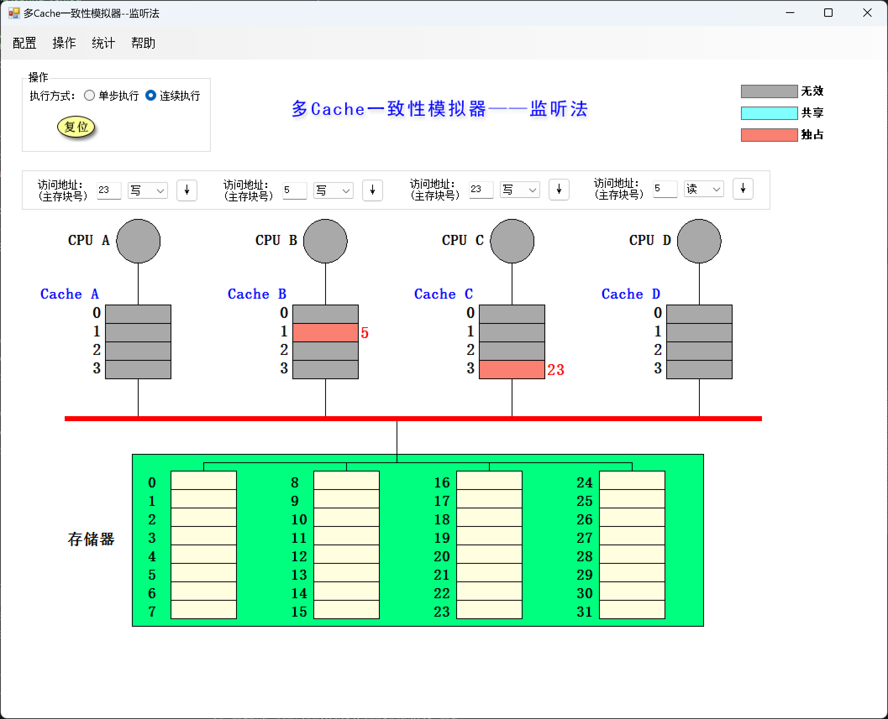
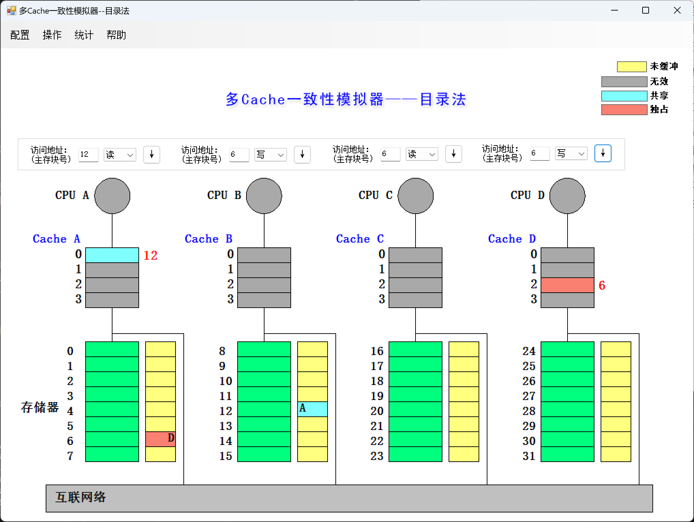

# Lab 6 Report
## Tomasulo模拟器
### 1.
当前周期2:

当前周期3:

- 进入周期2时，Load1中的地址由21（第一条Load指令的立即数）变为R[R2]+21，Load2变为Busy，Load2中的地址变为第二条Load指令的立即数0。
- 进入周期3时，Load1完成读取，得到了M[R[R2]+21]，Load2中的地址变为R[R3]+0。

### 2.
MUL.D 刚开始执行时系统状态：

整个系统发生的变化：
- 指令状态：MUL.D和SUB.D进入执行阶段，ADD.D指令流出。
- 保留站：ADD.D进入保留站，Add2变为busy。F2的值已准备好，因此Vk为M2；F8需等待SUB.D计算，因此Qj为Add1。
- 寄存器：ADD.D的目的寄存器为F6，因此F6的Qi变为Add2。
- load部件：无变化。

### 3.
数据相关。MUL.D的其中一个源寄存器为F2，而F2需等待L.D  F2,0(R3)的结果。

### 4.
15周期：

16周期：

- 进入15周期时，除MUL.D指令多执行一个周期（最后一个执行周期）外，系统无其他变化
- 进入16周期时，MUL.D执行完成，结果写入F0，F0变为no busy，保留站中Mult1变回no busy，M5（MUL.D的结果）被写入Mult2的Vj

### 5.
所有指令执行完毕为57周期。

## 多 cache 一致性算法监听法
### 1.
| 所进行的访问     | 是否发生了替换？ | 是否发生了写回？ | 监听协议进行的操作与块状态改变 |
| ---------------- | --- | --- | -- |
| CPU A 读第 5 块  | 是 | 否 | CPU A读未命中，发出BusRd，将第5块沿总线读入Cache A，Cache A第一块状态由无效变为共享 |
| CPU B 读第 5 块  | 是 | 否 | CPU B读未命中，发出BusRd，将第5块沿总线读入Cache B，Cache B第一块状态由无效变为共享 |
| CPU C 读第 5 块  | 是 | 否 | CPU C读未命中，发出BusRd，将第5块沿总线读入Cache C，Cache C第一块状态由无效变为共享 |
| CPU B 写第 5 块  | 否 | 否 | CPU B写命中，发出BusRdX，Cache B第一块由共享变为独占，Cache A和Cache C中第一块作废 |
| CPU D 读第 5 块  | 是 | 是 | CPU D读未命中，发出BusRd，CPU B监听到该信号，将Cache B中第1块写回内存中第5块，内存中第5块再沿总线传至Cache D中第一块，Cache B第一块由独占变共享，Cache D第一块由无效变共享 |
| CPU B 写第 21 块 | 是 | 否 | CPU B写未命中，发出BusRdX，将第21块沿总线读入Cache B中第一块，将原本的块换出（未发生写回），Cache B第一块变为独占 |
| CPU A 写第 23 块 | 是 | 否 | CPU A写未命中，发出BusRdX，将第23块沿总线读入Cache A中第三块，Cache A第三块变为独占 |
| CPU C 写第 23 块 | 是 | 是 | CPU C写未命中，发出BusRdX，CPU A监听到此信号，将Cache A中第三块写回内存中第23块，内存中第23块再沿总线传至Cache C中第三块，Cache A中第三块变为无效，Cache C中第三块变为独占 |
| CPU B 读第 29 块 | 是 | 是 | CPU B读未命中，发出BusRd信号，先将Cache B中第一块写回内存中第21块，再将内存中第29块读取至Cache B中第一块，Cache B中第一块变为共享 |
| CPU B 写第 5 块  | 是 | 否 | CPU B写未命中，发出BusRdX信号，将内存中第5块读入至Cache B中第一块，Cache B第一块变为独占，Cache D第一块变为无效 |

### 2.
执行完以上操作后整个cache系统的状态：

## 多 cache 一致性算法-目录法

### 1.
| 所进行的访问     | 协议进行的操作与块状态改变 |
| ---------------- | ------------------------------ |
| CPU A 读第 6 块  | 读未命中，本地向宿主节点发送读不命中(A,6)消息，宿主将主存第6块送给本地节点，Cache A中第2块被设为共享，存储器第6块的共享集合变为\{A\} |
| CPU B 读第 6 块  | 读未命中，本地向宿主节点发送读不命中(B,6)消息，宿主将主存第6块送给本地节点，Cache B中第2块被设为共享，存储器第6块的共享集合变为\{A, B\} |
| CPU D 读第 6 块  | 读未命中，本地向宿主节点发送读不命中(D,6)消息，宿主将主存第6块送给本地节点，Cache D中第2块被设为共享，存储器第6块的共享集合变为\{A, B, D\} |
| CPU B 写第 6 块  | 写命中，本地向宿主节点发送写命中(B,6)消息，宿主向A和D分别发送作废(6)消息，设置存储器第6块的共享集合为\{B\}，且变为独占，Cache B中第2块也变为独占 |
| CPU C 读第 6 块  | 读未命中，本地向宿主节点发送读不命中(C,6)消息，宿主向B发送取数据块(6)的消息，Cache B将数据块送给宿主，宿主将数据块送给本地节点，Cache C和Cache B中第2块被设为共享，存储器第6块的共享集合变为\{B, C\} |
| CPU D 写第 20 块 | 写未命中，本地向宿主节点发送写不命中(D,20)消息，宿主将主存第20块送给本地节点，Cache D中第0块被设为独占，存储器第20块的共享集合变为\{D\}，且变为独占 |
| CPU A 写第 20 块 | 写未命中，本地向宿主节点发送写未命中(A,20)消息，宿主向D发送取并作废(20)消息，Cache D将数据块送给宿主，将Cache D中第0块作废，宿主将数据块送给本地节点，设置存储器第20块的共享集合为\{A\}，且变为独占，Cache A中第0块变为独占 |
| CPU D 写第 6 块  | 写未命中，本地向宿主节点发送写未命中(D,6)消息，宿主向B和C发送作废(6)消息，Cache B和C中第2块作废，宿主将数据块送给本地节点，设置存储器第6块的共享集合为\{D\}，且变为独占，Cache D中第2块变为独占 |
| CPU A 读第 12 块 | 读未命中，需要将Cache A中第0块换出。本地向被替换块的宿主发送写回并修改共享集(A,20)消息，被替换块的宿主将第20块的共享集清空，改为未缓冲。本地向第12块的宿主阶段发送读不命中(A,12)消息，宿主将数据块送给本地节点，将主存中第12块的共享集合修改为\{A\}，Cache A中第0块变为共享 |

### 2.
执行完以上操作后整个cache系统的状态：

## 回答问题
### 1.
- 目录法
  - 优点：不需要总线向所有CPU广播，减少了总线的负担。
  - 缺点：需要维护目录表，增加了存储开销。
- 监听法
  - 优点：不需要维护目录表，减少了存储开销。
  - 缺点：需要总线向所有CPU广播，增加了总线的负担。核心数增多时，总线的冲突可能导致其成为瓶颈。

### 2.
- 记分牌解决了RAW相关，而Tomasulo算法解决了WAW、WAR和RAW相关。
- 记分牌是集中式，维护一个中央的记分牌数据结构；Tomasulo是分布式，将控制和缓存分布在各个部件中。

### 3.
- 结构相关：Tomasulo对每个部件均有busy标志，表示其是否空闲，当一条指令需要的执行单元被占满时，暂停该指令发射。
- RAW相关：当指令发射时，Tomasulo算法检查操作数是否可用，若有操作数对应的指令尚未执行完成，则暂停发射。当对应的指令执行完成时，会将结果广播，从而需要该操作数的指令可以获得数据。
- WAR相关：通过寄存器重命名。指令中的寄存器在RS中用寄存器值或指向RS的指针代替，即直接指明产生该值的功能部件，从而保证不会因乱序执行读取到错误的值。
- WAW相关：